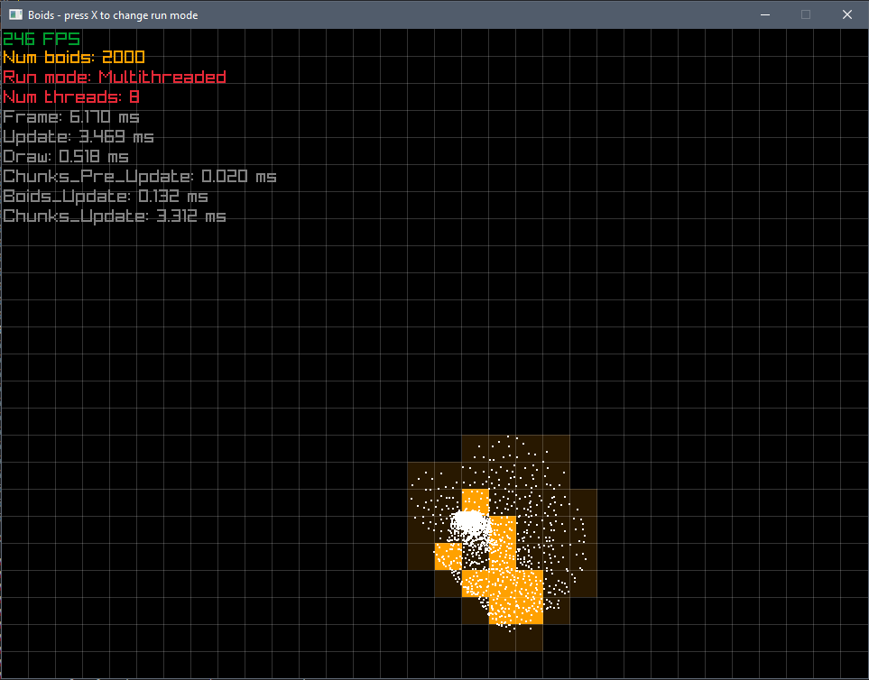
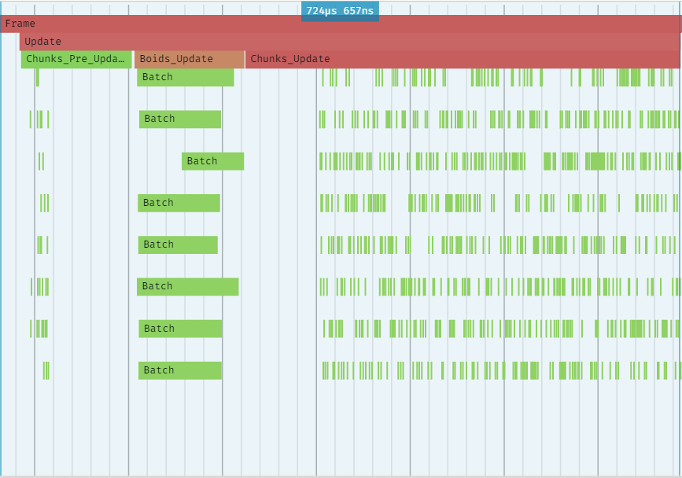

# Jobs
A simple job system for Odin.

## Overview

The design is inspired by fiber-based job systems, most notably the one used at Naughty Dog.
(see [Parallelizing the Naughty Dog Engine](https://www.gdcvault.com/play/1022186/Parallelizing-the-Naughty-Dog-Engine)).

Instead of using fibers, this job system just directly runs queued jobs
on the waiting thread. From an API perspective, this is basically the same as fibers.
It might require more stack space in your worker threads, but there is no need to allocate stacks for fibers.

Also there is no chance of ending up on another thread after using `wait`, so you can use TLS.

### Features:
- dispatching and waiting for jobs to finish
- nested jobs
- utilities for batch processing of slices/arrays
- full control over the thread processing loop

### Notes:
- the jobs are queued on a linked list (FILO queue)
- the individual jobs are allocated with `context.temp_allocator` (or manually)

## A simple hello world program
```odin
main :: proc() {
    jobs.initialize()

    g: jobs.Group
    jobs.dispatch(.Medium, jobs.make_job(&g, hello_job))
    jobs.wait(&g)

    jobs.shutdown()
}

hello_job :: proc(_: rawptr) {
    fmt.println("Hello from thread", jobs.current_thread_index())
}

```

## Examples
See the [examples](examples/) directory for all examples.

All examples:
- [hello](examples/hello/hello.odin) - a very basic introduction to jobs
- [simple](examples/simple/simple.odin) - simple overview with most of the features
- [boids](examples/boids/boids.odin) - boids simulation with Raylib




## TODO
- improve the examples (boids are especially wonky)
- use atomic linked list instead of using spinlocks

## Contributing
All contributions are welcome!
